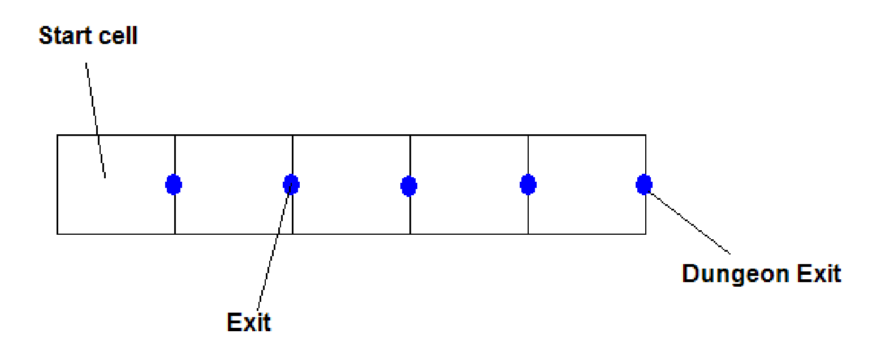

The Zork Game
=============

In this project you will be creating a very simple adventure game. The game will
be **text-based or menu-driven** similar to the old Zork
(<http://en.wikipedia.org/wiki/Zork>) games. The game is played in a dungeon
that has between 5 and 10 cells or rooms. The objective of the game is to exit
the dungeon while still alive. Upon startup of the game, the dungeon is
initialized with at least 5 cells and at most 10. The number of cells is
determined randomly. Each cell will have an east exit, a west exit, or both.
Each exit leads to an adjacent cell or out of the dungeon. The rightmost cell in
the dungeon will have the exit out of the dungeon. See the diagram below.

If the dungeon is to have 5 cells then the following conceptual structure is to
be created:

Notice that the start cell has one exit and the others have two exits.

The game begins with the player in the start cell. The player starts the game
with 100 health points. To move from room to room, the user types: “**go
\<direction\>**”, where direction can either be “**east**” or “**west**.” If it
is possible to go in the specified direction, the player then goes to the
specified cell. If it is not possible to go in that direction, the program
should display “**Sorry, but I can’t go in that direction**.” If the player
reaches the exit, the program should print “**You have beaten the dungeon!**”

There is a **50%** chance that any cell other than the start cell has a monster
in it. A monster starts with 20 health points. If there is a monster in the
cell, the program should display “**There is a monster here!**” The player has
to kill the monster before s/he can exit the room to an adjacent room. There is
a **10%** chance of missing the monster. If the player misses the monster then
system should display “**a miss**” otherwise the system displays “**a hit!**” If
the player hits the monster, 5 health points are deducted from the monster.
After which, it is the monster’s turn to hit the player. There is a **20%**
chance that the monster misses the player. If the monster misses the player, the
program displays “**The monster missed the player**.” otherwise the program
should display “**The player is hit**.” If the monster hits the player, 4 health
points are deducted from the player. The fight continues until either the
monster’s health-points or the player’s health-points drop to zero. If the
player’s health points drop to zero then the game is over and the program
displays “**The player is dead. The game is over!**”

Once a monster is dead, it remains dead for the rest of the game. If the player
returns to the room for some reason, there is no need to fight the monster
again.

When the player enters a cell, the program should display the amount of health
points the player has left. If the user enters a command that is not recognized
then the program should display “**I do not know what you mean**.” Feel free to
add any additional messages that you see fit.

The player may find a single **weapon** in **one** of the cells. The weapon can
either be a **sword** or a **stick** with equal probability. If there is a
**weapon** and a **monster** in the same cell, the player can pick up and use
the weapon. If the player has a **sword** then s/he does an additional 3 points
of damage to the monster. A **stick** causes an additional 1 point of damage.
The player may take the weapon to other rooms and use it there once he/she has
it.

You are required to design and then program this game in Java. You may use
console I/O, JOptionPane I/O, or both. If you use both, the program must “feel
user-friendly.” The program may be menu-driven if you wish. You may add other
“bells and whistles” such as additional types of **weapons** or **monsters** to
the game. Use **inheritance** appropriately.

Restrictions:
=============

-   Use good object-oriented principles

-   Your design **must** use **arrays** and/or **ArrayLists** where appropriate
    and useful

-   All **input** and **output** is restricted to the **driver** program.

-   The **driver** should instantiate and use an object of a class named
    **Game** or **GameManager** that coordinates the game activities and
    characters.

-   Use *inheritance* where appropriate. For example, the *Sword* class and the
    *Stick* class must both derive from a *Weapon* class (potentially abstract).
    The **Player** and the **Monster** classes must derive from a
    **Participant** class (possibly abstract).

-   Use exception-handling to deal with any unexpected situations that are
    encountered.

Hint: Percentages
=================

>   There are several places in this assignment where you are asked to do or not
>   do something a specified percentage of the time. The easiest way to handle
>   this is to use an object of the Random class to generate a random integer
>   between say 0 and 10000. If the generated random number is in the first “N
>   percent of the range” where N is the percentage of the time the action
>   should be taken, do the action. Otherwise do not do it.

>   For example, if **actionX** is to be done **20%** of the time, **20%** of
>   10000 is 2000. The following code shows how you might use this fact.

>   **Random ran = new Random ( );**

>   **. . .**

>   **if (ran.nextInt (10000) \< 2000)**

>   **// do actionX**

>   **else**

>   **// do not do actionX**

Extra Credit: (Up to 10 total bonus points for doing both of these)
===================================================================

-   Derive 3 types of **Monsters** (for example, **Cyclops**, **King Kong**, and
    **Frankenstein**) from the **Monster** class, each with its own number of
    health points and its own amount of damage it can inflict. When assigning a
    monster to a cell, first decide whether some type of monster will be in the
    cell based on probability. If so, select one of the 3 types randomly (with
    equal probability) to assign to that cell. A cell can have 0 monsters or one
    total monster from among all the types. There is still only a **50%** chance
    of some monster being in a given cell. Also derive 3 other types of Weapons
    (e.g., **Knife**, **Laser**, **Bomb**, or **Gun**) from the **Weapon**
    class.

-   Make the dungeon two-dimensional with at most 5 rows of cells and at most 10
    columns of cells. You will need to add the ability to move **north** and
    **south** as well as **east** and **west**. The dungeon has only **one
    entrance** and **one exit**. The **entrance** is the **top**, **left** cell.
    The **exit** is on the **east**, but may be on **any row**. Set the **exit**
    row **randomly** with equal probability that is on any row.

-   If you plan to attempt the extra-credit part, your design must include that.

-   Additional “bells and whistles” that make your solution more interesting are
    quite welcome.

Team Project
============

You may work in groups of **up to three** on this assignment. Each person should
contribute approximately the same amount of the work. Names of all team members
should be included in the names of the files you submit. For example,
**1260-201-JimNasium-LindaHand-Project5.zip** may be the name of a file
submitted by Jim Nasium and Linda Hand for project 5 where Jim and Linda are in
1260 section 201. Include the final design in your submission.

Example Dialog Between the Program and the User
===============================================

The following page shows an example of the interaction between the program and
the user for one game. **This is only an example**. You are encouraged to use
your imagination to make the program even more user-friendly. Remember that the
driver is responsible for all user interaction.

| [./media/image2.png](./media/image2.png) |
|------------------------------------------|

